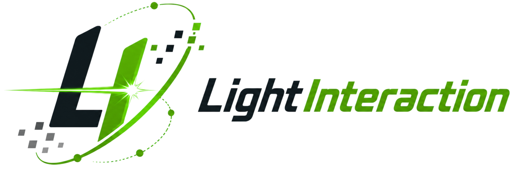
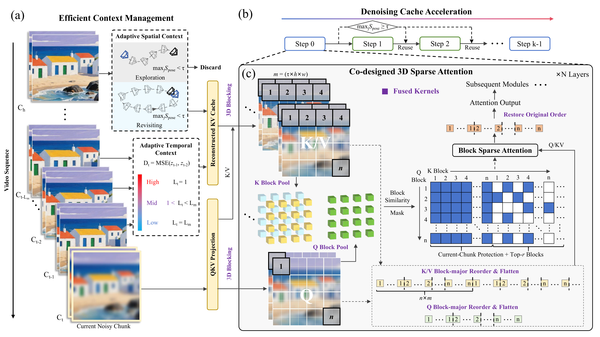

<p align="center">
  
</p>

<h3 align="center">
<a href="https://arxiv.org/abs/2605.31158"><b>📄 Paper</b></a> | <a href="https://2843721358l-del.github.io/Light-Interaction-Project/"><b>🌐 Project Page</b></a>
</h3>

<p align="center">
  <a href="https://arxiv.org/abs/2605.31158"></a> &ensp;
  <a href="LICENSE"></a>
</p>

**Light Interaction** is a training-free inference acceleration framework for interactive video world models. It accelerates autoregressive interactive video generation without model retraining by combining **Adaptive Context Management**, **Denoising Cache Acceleration**, and **Hardware-Software Co-designed 3D Sparse Attention**. On a single A100 GPU, Light Interaction achieves up to **2.59× speedup** on HY-WorldPlay and **1.61× speedup** on Matrix-Game-3.0, while maintaining competitive visual quality with **24.81 PSNR** against the original model.

<p align="center" border-radius="10px">
  
</p>

## 🔥 News

- 🔥 [2026/06] 🚀 **Light Interaction code released!** HY-WorldPlay acceleration patch and evaluation utilities are available. Matrix-Game-3.0 integration is coming soon.
- 🔥 [2026/05] 📄 **Paper** is on ArXiv! Check out the details at [arXiv:2605.31158](https://arxiv.org/abs/2605.31158).

<details>
  <summary>Click to show all updates</summary>

- ✅ [2026/06] HY-WorldPlay acceleration patch released. Includes standalone acceleration modules, integration patch, preset-based ablation switches, and latency / memory reporting.
- ✅ [2026/06] Evaluation utilities released. Includes fixed 200-prompt sample set, batch generation helpers, PSNR / SSIM / LPIPS evaluation, and selected VBench evaluation.
- ✅ [2026/06] Sparse attention backend released with Triton fused kernels for autoregressive interactive video generation.

</details>

## 💡 Introduction

We introduce **Light Interaction**, a training-free inference acceleration framework for interactive video world models. Interactive video world models generate video chunk by chunk in response to user-controlled camera movements, paving the way toward real-time game simulation, virtual scene navigation, and embodied AI training. However, scaling to long interactive trajectories is prohibitively expensive due to growing context memory, quadratic attention complexity, and repeated denoising steps.

**Key Insight:** Interaction naturally enables adaptive computation — the usefulness of different computation evolves with interaction dynamics. Pose-aware retrieval similarity can gate spatial memory, local latent dynamics can adapt temporal context, and early-step outputs can be reused during revisiting.

**Key Techniques:**

- **Adaptive Context Management**: Prunes spatial memory by camera-pose-aware similarity and adjusts temporal windows according to local latent dynamics. Distinguishes novel exploration (discard irrelevant retrieved memory) from trajectory revisiting (retain useful historical views).
- **Denoising Cache Acceleration**: Reuses early-step model outputs for intermediate denoising steps when camera-pose-aware similarity indicates reliable revisiting, while preserving the final step for quality correction.
- **Hardware-Software Co-designed 3D Block Sparse Attention**: Preserves text and current-chunk tokens, sparsifies only historical visual KV blocks, and uses fused Triton kernels to eliminate layout-conversion and gather/scatter overhead under autoregressive causal constraints.

**In summary**, Light Interaction is a **training-free, plug-and-play** acceleration framework that can be applied on top of existing interactive video world models. It requires **no model retraining** and achieves significant speedup with competitive visual quality.

## 🚀 Deployment Guide

Follow these steps to deploy Light Interaction on HY-WorldPlay. For detailed documentation on each step, click through to the corresponding sub-README.

### Step 1 — Setup Upstream HY-WorldPlay

Follow the official [HY-WorldPlay](https://github.com/Tencent-Hunyuan/HY-WorldPlay) instructions to clone the repository and download model checkpoints. Make sure you can run the original model successfully before proceeding.

### Step 2 — Apply the Light Interaction Patch

Apply our acceleration modules and integration patch onto the upstream HY-WorldPlay checkout:

```bash
git clone https://github.com/2843721358l-del/Light-Interaction-Project.git
cd Light-Interaction-Project/hy-worldplay
bash scripts/apply_patch.sh /path/to/HY-WorldPlay
```

> 📖 See [hy-worldplay/README.md](hy-worldplay/README.md) for the full list of patched files, Triton kernel details, and diagnostic options.

### Step 3 — Configure Model Paths & Run

```bash
cd /path/to/HY-WorldPlay
export HY_MODEL_PATH=/path/to/HunyuanVideo-1.5
export HY_AR_DISTILL_ACTION_MODEL_PATH=/path/to/HY-WorldPlay/ar_distilled_action_model/diffusion_pytorch_model.safetensors
# Optional: single-GPU inference (default uses 8 GPUs)
export HY_N_INFERENCE_GPU=1
bash run.sh
```

> [!TIP]
> The default preset `all` enables all three acceleration components: **context management + 3D sparse attention + denoising cache**. To switch presets, edit the `--acceleration_preset` line in `run.sh` to `off`, `context`, `sparse`, `cache`, or `all`. See [Presets Guide](hy-worldplay/README.md#-presets) for details.

### Step 4 — (Optional) Run Evaluation Benchmarks

Generate videos in batch and compute quality metrics:

```bash
# Batch generation
python evaluation/scripts/batch_video_generation.py \
  --prompt-json evaluation/data/refined_prompts_llava16.json \
  --hy-worldplay-root /path/to/patched/HY-WorldPlay \
  --model-path /path/to/HunyuanVideo-1.5 \
  --action-ckpt /path/to/ar_distilled_action_model/diffusion_pytorch_model.safetensors \
  --output-root outputs/fixed_prompt \
  --allowed-gpus 0,1,2,3 \
  --acceleration-preset all

# PSNR / SSIM / LPIPS
python evaluation/scripts/evaluate_psnr_ssim_lpips.py \
  --run-mutual --ref-dir outputs/baseline --test-dir outputs/light_interaction \
  --output-dir evaluation_results --tag left_right --mutual-window 30

# VBench
python evaluation/scripts/evaluate_vbench_batch.py \
  --prompt-json evaluation/data/refined_prompts_llava16.json \
  --video-dir outputs/light_interaction/left_right \
  --output-csv evaluation_results/vbench_left_right.csv
```

> 📖 See [evaluation/README.md](evaluation/README.md) for mutual vs. self-comparison modes, window search explanation, and VBench dimension details.

### 📚 Documentation Map

| Document | Contents |
|:---|:---|
| [hy-worldplay/README.md](hy-worldplay/README.md) | Patch structure, apply instructions, presets, latency reporting, Triton autotuning, diagnostics |
| [evaluation/README.md](evaluation/README.md) | Sample set, batch generation, PSNR/SSIM/LPIPS mutual & self evaluation, VBench |

## 📊 Performance

### HY-WorldPlay (480P, Image-to-Video)

<table>
  <thead>
    <tr>
      <th rowspan="2" align="center">Method</th>
      <th colspan="3" align="center">vs. Original</th>
      <th colspan="3" align="center">Self-Comparison</th>
      <th rowspan="2" align="center">VBench↑</th>
      <th rowspan="2" align="center">Latency↓ (s)</th>
      <th rowspan="2" align="center">Speedup↑</th>
      <th rowspan="2" align="center">Mem.↓ (GB)</th>
    </tr>
    <tr>
      <th align="center">PSNR↑</th>
      <th align="center">SSIM↑</th>
      <th align="center">LPIPS↓</th>
      <th align="center">PSNR↑</th>
      <th align="center">SSIM↑</th>
      <th align="center">LPIPS↓</th>
    </tr>
  </thead>
  <tbody>
    <tr>
      <td align="center">Original</td>
      <td align="center">–</td><td align="center">–</td><td align="center">–</td>
      <td align="center">18.60</td><td align="center">0.5678</td><td align="center">0.2051</td>
      <td align="center">0.8190</td><td align="center">228.60</td><td align="center">1.00×</td><td align="center">76.57</td>
    </tr>
    <tr>
      <td align="center">SVG</td>
      <td align="center">19.48</td><td align="center">0.6028</td><td align="center">0.2209</td>
      <td align="center">17.75</td><td align="center">0.5299</td><td align="center">0.2187</td>
      <td align="center">0.8082</td><td align="center">247.65</td><td align="center">0.92×</td><td align="center">77.86</td>
    </tr>
    <tr>
      <td align="center">BSA</td>
      <td align="center">15.94</td><td align="center">0.4639</td><td align="center">0.3755</td>
      <td align="center">15.44</td><td align="center">0.4205</td><td align="center">0.3720</td>
      <td align="center">0.7943</td><td align="center">474.57</td><td align="center">0.48×</td><td align="center">75.03</td>
    </tr>
    <tr>
      <td align="center">TeaCache</td>
      <td align="center">20.90</td><td align="center">0.6588</td><td align="center">0.1892</td>
      <td align="center">18.86</td><td align="center">0.5743</td><td align="center">0.2054</td>
      <td align="center">0.8150</td><td align="center">203.25</td><td align="center">1.12×</td><td align="center">76.64</td>
    </tr>
    <tr>
      <td align="center"><b>Ours</b></td>
      <td align="center"><b>24.81</b></td><td align="center"><b>0.6500</b></td><td align="center"><b>0.1788</b></td>
      <td align="center"><b>18.85</b></td><td align="center"><b>0.5854</b></td><td align="center"><b>0.1963</b></td>
      <td align="center"><b>0.8220</b></td><td align="center"><b>88.24</b></td><td align="center"><b>2.59×</b></td><td align="center"><b>54.66</b></td>
    </tr>
  </tbody>
</table>

### Matrix-Game-3.0 (720P, Image-to-Video)

<table>
  <thead>
    <tr>
      <th rowspan="2" align="center">Method</th>
      <th colspan="3" align="center">vs. Original</th>
      <th colspan="3" align="center">Self-Comparison</th>
      <th rowspan="2" align="center">VBench↑</th>
      <th rowspan="2" align="center">Latency↓ (s)</th>
      <th rowspan="2" align="center">Speedup↑</th>
      <th rowspan="2" align="center">Mem.↓ (GB)</th>
    </tr>
    <tr>
      <th align="center">PSNR↑</th>
      <th align="center">SSIM↑</th>
      <th align="center">LPIPS↓</th>
      <th align="center">PSNR↑</th>
      <th align="center">SSIM↑</th>
      <th align="center">LPIPS↓</th>
    </tr>
  </thead>
  <tbody>
    <tr>
      <td align="center">Original</td>
      <td align="center">–</td><td align="center">–</td><td align="center">–</td>
      <td align="center">15.49</td><td align="center">0.4685</td><td align="center">0.4048</td>
      <td align="center">0.7432</td><td align="center">59.70</td><td align="center">1.00×</td><td align="center">35.04</td>
    </tr>
    <tr>
      <td align="center">SVG</td>
      <td align="center">12.98</td><td align="center">0.4170</td><td align="center">0.5587</td>
      <td align="center">14.48</td><td align="center">0.4949</td><td align="center">0.4406</td>
      <td align="center">0.7511</td><td align="center">96.16</td><td align="center">0.62×</td><td align="center">35.02</td>
    </tr>
    <tr>
      <td align="center">BSA</td>
      <td align="center">13.34</td><td align="center">0.4228</td><td align="center">0.5795</td>
      <td align="center">16.66</td><td align="center">0.5326</td><td align="center">0.4094</td>
      <td align="center">0.7336</td><td align="center">63.26</td><td align="center">0.94×</td><td align="center">35.03</td>
    </tr>
    <tr>
      <td align="center">TeaCache</td>
      <td align="center">19.03</td><td align="center">0.5619</td><td align="center">0.3818</td>
      <td align="center">18.84</td><td align="center">0.5765</td><td align="center">0.3602</td>
      <td align="center">0.7146</td><td align="center">41.49</td><td align="center">1.44×</td><td align="center">35.32</td>
    </tr>
    <tr>
      <td align="center"><b>Ours</b></td>
      <td align="center"><b>17.76</b></td><td align="center"><b>0.5306</b></td><td align="center"><b>0.3692</b></td>
      <td align="center"><b>14.63</b></td><td align="center"><b>0.4570</b></td><td align="center"><b>0.4424</b></td>
      <td align="center"><b>0.7350</b></td><td align="center"><b>37.07</b></td><td align="center"><b>1.61×</b></td><td align="center"><b>35.04</b></td>
    </tr>
  </tbody>
</table>

> **vs. Original** compares each method with the original full-computation model. **Self-Comparison** compares frame pairs with similar camera poses within the same revisiting trajectory to evaluate consistency.

### Ablation Study — Individual Components (HY-WorldPlay)

| Variant | Latency↓ (s) | Speedup↑ | vs. Orig. PSNR↑ | Self-Comp. PSNR↑ | VBench↑ | Mem.↓ (GB) |
|:---|---:|---:|---:|---:|---:|---:|
| Original Model | 228.60 | 1.00× | – | 18.60 | 0.8190 | 76.57 |
| Only Context Mgmt. (Temporal) | 152.88 | 1.50× | 31.98 | 20.11 | 0.8208 | 54.66 |
| Only Context Mgmt. (Spatial) | 213.71 | 1.07× | 38.73 | 18.85 | 0.8191 | 76.57 |
| Only Context Mgmt. (Full) | 144.49 | 1.58× | 29.24 | 20.20 | 0.8210 | 54.66 |
| Only Denoising Cache | 198.10 | 1.15× | 55.16 | 19.02 | 0.8199 | 76.57 |
| Only 3D Sparse Attn. | 153.69 | 1.49× | 25.53 | 18.27 | 0.8208 | 76.57 |
| **Full Light Interaction** | **88.24** | **2.59×** | **24.81** | **18.85** | **0.8220** | **54.66** |

## 🎛️ Acceleration Presets

The HY-WorldPlay patch exposes five presets for reproduction and ablation studies:

| Preset | Description |
|:---|:---|
| `off` | All acceleration components disabled. Uses dense attention, upstream temporal context, no FOV filtering, no denoising cache. |
| `context` | Only Adaptive Context Management enabled. Temporal context reduction + spatial/FOV context filtering, dense attention, no denoising cache. |
| `sparse` | Only Soft-Hard Cooperative 3D Sparse Attention enabled. Sparse attention in both AR denoising and KV-cache recomputation, upstream context setting, no denoising cache. |
| `cache` | Only Denoising Cache Acceleration enabled. Dense attention, upstream context setting, FOV-based denoising-step reuse. |
| `all` | **Default.** All three components enabled: context management + 3D sparse attention + denoising cache acceleration. |

## 📂 Repository Structure

```text
Light-Interaction-Project/
├── README.md                    # Project overview (this file)
├── NOTICE.md                    # Third-party notices
├── LICENSE                      # Apache 2.0
├── asset/                       # Teaser and figures
├── hy-worldplay/                # HY-WorldPlay acceleration patch
│   ├── README.md                # Detailed patch documentation
│   ├── files/                   # Standalone acceleration modules
│   ├── patches/                 # Integration patch for upstream files
│   └── scripts/                 # Patch application helper
└── evaluation/                  # Evaluation scripts and benchmarks
    ├── README.md
    ├── data/                    # Fixed 200-prompt evaluation set
    └── scripts/                 # PSNR / SSIM / LPIPS / VBench scripts
```

## ✅ To-Do List

- [✅] HY-WorldPlay acceleration patch (adaptive context mgmt. + 3D sparse attn. + denoising cache)
- [✅] Hardware-software co-designed 3D block sparse attention with Triton fused kernels
- [✅] Five acceleration presets for ablation studies
- [✅] Latency and peak memory reporting infrastructure
- [✅] Evaluation scripts (PSNR, SSIM, LPIPS, VBench)
- [✅] Fixed 200-prompt evaluation set
- [ ] Matrix-Game-3.0 acceleration patch (integration patch under cleaning)
- [ ] Additional upstream model support
- [🚀] See you in the future

## 🤗 Acknowledgements

This project builds upon and thanks the following open-source projects:

- [HY-WorldPlay](https://github.com/Tencent-Hunyuan/HY-WorldPlay) — Interactive video world model
- [HunyuanVideo-1.5](https://huggingface.co/tencent/HunyuanVideo-1.5) — Video generation foundation model
- [LongCat-Video](https://github.com/Meituan-Dianping/LongCat-Video) — Sparse attention backbone
- [Matrix-Game-3.0](https://github.com/Matrix-Game/Matrix-Game-3.0) — Interactive world model
- [VBench](https://github.com/Vchitect/VBench) — Video generation benchmark
- [Sparse VideoGen (SVG)](https://github.com/mit-han-lab/SparseVideoGen) — Sparse attention baseline
- [TeaCache](https://github.com/LiewFeng/TeaCache) — Denoising cache baseline

We thank the authors and contributors of these projects for releasing their code, models, and tools to the community.

## 📖 BibTeX

```bibtex
@misc{lu2026lightinteractiontrainingfreeinference,
  title={Light Interaction: Training-Free Inference Acceleration for Interactive Video World Models},
  author={Jiacheng Lu and Haoyi Zhu and Sipei Yi and Enze Xie and Yu Li and Cheng Zhuo},
  year={2026},
  eprint={2605.31158},
  archivePrefix={arXiv},
  primaryClass={cs.CV},
  url={https://arxiv.org/abs/2605.31158}
}
```

## 📄 License

This repository contains our patch code and integration diffs. It does **not** redistribute upstream repositories, checkpoints, or generated assets. Upstream projects and model weights are governed by their own licenses.

- HY-WorldPlay has its own upstream license terms. Users must obtain HY-WorldPlay from the official source and comply with its license and acceptable-use policy.
- Parts of the sparse-attention backend are adapted from LongCat-Video and are subject to the original LongCat-Video MIT license notice.

See [NOTICE.md](NOTICE.md) for details.
